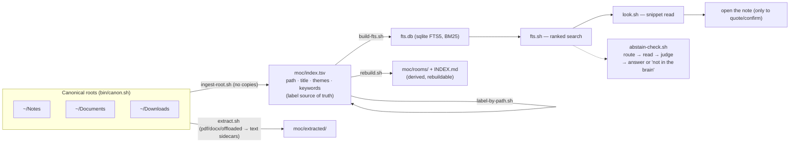

# NewBrain — a no-copy second brain for LLM & AI agents

A personal knowledge index that lets an AI agent (Claude Code or any model that can run bash)
search, read, and honestly abstain over YOUR notes — without moving, copying, or converting a
single file. Pure bash + ripgrep + sqlite FTS5. Zero model calls, zero API, zero network in the
engine. Works with the agent completely off.

**This is a blueprint, not a turnkey app.** The engine ships as-is; the index, room taxonomy,
and folder mappings are yours, regenerated on your machine by the [INSTALL.md](INSTALL.md)
bootstrap. Several files are explicitly marked `EDIT:` templates.

## Compatibility

**Claude Code only, for now.** The engine is agent-agnostic bash, but the wiring that makes
the system automatic — the SessionStart digest hook, the discovery trigger rows, the
agent-run install — is built and tested against Claude Code (CLI, desktop app, or IDE
extension), on macOS. The full honest matrix (Claude Desktop's degraded path, Codex CLI
status, Windows/WSL, the exhaustive macOS-only list) is in
[docs/COMPATIBILITY.md](docs/COMPATIBILITY.md).

## Architecture

The search ladder is the point: **read-less-first**. The agent scans ranked hits, reads cheap
snippets from the extract tier, and only opens a full note to quote it. `DOCTRINE.md` is the
behavioral half — when to search, how to decompose a question into tight keywords, and when to
honestly say "not in the brain" instead of guessing.

## Philosophy

- **No copies, ever.** Notes live once, in their real homes. The brain is an *access layer*:
  an index of labels pointing at canonical paths. Delete the brain, lose nothing.
- **Never move or rename a Finder-visible file.** Labels live in `moc/index.tsv`, not in your
  folder structure. Organizing = editing a TSV row, not dragging files.
- **Agent-OFF engine.** Everything in `bin/` is pure bash + ripgrep + sqlite. It runs cold, in
  any terminal, with no model in the loop. The model supplies judgment (query decomposition,
  abstain decisions, synthesis), never plumbing.
- **Honest abstention over forced matches.** `⚠ WEAK MATCH` output is the mechanical basis for
  answering "that's not in the brain" — the failure mode this system was built to kill is an
  agent confidently answering about your notes without ever looking.

## What's in the box

| Piece | What it does |
|---|---|
| `bin/canon.sh` | **EDIT template** — your canonical roots + prune lists + artifact ignore list |
| `bin/ingest-root.sh`, `build-index.sh` | walk roots, append new files to `index.tsv` (dedup, no copies) |
| `bin/label-by-path.sh` | **EDIT template** — folder → room mapping, fills unlabeled rows only |
| `bin/extract.sh` | plaintext sidecars for PDFs/docx/iCloud-offloaded files (800KB body cap) |
| `bin/build-fts.sh`, `fts.sh` | sqlite FTS5 build + BM25-ranked search |
| `bin/look.sh` | ranked hits + capped snippets — the primary read path |
| `bin/abstain-check.sh` | 2–3 query variants → routing hint (CONVERGENT/MIXED/DIVERGENT/DRY) |
| `bin/search.sh` | exact-phrase regex fallback over live note bodies |
| `bin/refresh.sh` | one-command freshness pass (ingest → label → extract → rebuild → FTS) |
| `bin/rebuild.sh` | redraw derived room MOCs from the index |
| `bin/compile-room.sh`, `stale-wikis.sh`, `room-stamp.sh` | on-demand room wikis + anti-rot stamps |
| `bin/capture.sh`, `file-note.sh`, `index-add.sh`, `synth-save.sh` | capture + write-back paths |
| `bin/lint.sh`, `recent.sh`, `inbox-status.sh`, `reach-map.sh` | health + maintenance |
| `bin/delete-candidates.sh`, `verify-dupes.sh` | LIST-ONLY cleanup reports (never delete anything) |
| `bin/brain-digest.sh`, `register-digest-hook.sh` | SessionStart priming digest (Claude Code hook) |
| `bin/expand.sh`, `backfill-*.sh`, `label-container-types.sh`, `kw-dict.tsv` | optional/experimental — headers state what was measured, incl. negative results |
| `DOCTRINE.md` | the agent-side access doctrine (load into your agent's context) |
| `templates/` | MAP skeleton + discovery-hook trigger rows |
| `install.sh` / `verify-install.sh` | one-command bootstrap + machine-checked acceptance gates |

## Documentation

| Doc | What's in it |
|---|---|
| [docs/HOW-IT-WORKS.md](docs/HOW-IT-WORKS.md) | the deep walkthrough: index anatomy (index.tsv, fts.db, extracts), the read-less-first search ladder with real commands, the labeling misc-trap, why the doctrine exists |
| [docs/COMPATIBILITY.md](docs/COMPATIBILITY.md) | full platform matrix: agent platforms, operating systems, the exhaustive macOS-only list, dependencies |
| [docs/TROUBLESHOOTING.md](docs/TROUBLESHOOTING.md) | sandbox-tested failure modes: installer refusals, verify-install output interpretation, empty search results, labeling and refresh pitfalls |
| [DOCTRINE.md](DOCTRINE.md) | the agent-side access doctrine — the behavioral half, loaded into your agent's context |
| [INSTALL.md](INSTALL.md) | the hybrid bootstrap: install.sh does the deterministic work, one agent step authors your taxonomy |

## Use cases

- You keep notes as plain files (Markdown, PDFs, docx) scattered across real folders and want
  your coding agent to answer "what do I know about X?" from them — without a migration.
- You want **honest** retrieval: "not in the brain" as a first-class answer, not hallucinated
  recall.
- You want capture → label → find with zero vendor lock-in: the whole state is one TSV + one
  rebuildable sqlite file.

## When NOT to use this

- **You want semantic/embedding search.** Deliberately absent. The author evaluated a local
  embedding model against this corpus and **rejected it**: portability cost (Python + model
  weights vs. pure bash) outweighed measured gains, and query decomposition by the agent closed
  most of the gap. If your notes need conceptual similarity search, use a vector tool instead.
- **You have under a few hundred notes.** Just grep. This earns its keep at ~1,000+ files
  spread over messy roots.
- **Your notes live in cloud apps** (Notion, Evernote, Apple Notes without export). The engine
  indexes *files on disk*. Export first or look elsewhere.
- **You never use a terminal-capable agent.** The doctrine half assumes an agent that can run
  bash.

## Security notes

- The engine makes **no network calls** and phones nothing home; it reads your files and writes
  only inside its own `moc/` directory (plus capture destinations you configure).
- `canon.sh` prunes a `Resources/Sensitive/` path by default — keep credentials/secrets in one
  hard-blocked folder and the index never sees them. Pair with a PreToolUse hook that refuses
  agent reads of that path (pattern in the companion claude-optimization repo).
- `delete-candidates.sh` and `verify-dupes.sh` are LIST-ONLY by design: nothing in this repo
  deletes, moves, or renames your files. The riskiest write anywhere is appending a TSV row.
- Review any hook before registering it: hooks run arbitrary shell in your session.

## Portability

Claude Code is the supported and tested target today; everything below is the honest
future-portability story (details and per-platform status: [docs/COMPATIBILITY.md](docs/COMPATIBILITY.md)).

- **Engine:** any machine with bash, ripgrep, and sqlite3 (macOS out of the box; note
  `ls -lO`-based iCloud-offload detection is macOS-specific — harmless elsewhere).
- **Agent:** any model that can run shell commands can in principle drive the full ladder —
  Codex-style CLIs, open-weights models in an agent harness (untested). `DOCTRINE.md` is
  plain markdown; paste it into any agent's context.
- **Claude Code-specific:** only the SessionStart digest hook wiring
  (`register-digest-hook.sh`) and the discovery-hook trigger rows in `templates/`. The
  *pattern* (prime each session with a bounded map + access line) ports to any harness with
  session-start hooks.

## Measured results — author-measured, N=1, on his corpus

These numbers come from the author's own ~1,650-note corpus and have not been independently
reproduced; treat them as existence proofs, not benchmarks.

- Room-wiki A/B (compiled wiki vs. raw search, 30 questions): **28 wins / 0 losses / 2 ties**
  for the wiki, with **~43% fewer tool calls**.
- Trap-honesty eval (10 questions whose answers are NOT in the corpus): **10/10 honest
  abstentions** using the route→read→judge ritual, 0 false abstentions on answerable controls.
- Corpus-hygiene pass (labels + keywords + extracts): cold-start hits@3 **55% → 64%**.
- Mechanical query expansion (`expand.sh`) was measured to HURT ranked retrieval and is shipped
  disconnected, as a documented negative result.

## Install

Install is two layers:

1. **`./install.sh`** [no LLM needed] — checks dependencies (ripgrep, sqlite3), walks you
   through picking your note roots, builds the index and the ranked-search database, and
   smoke-tests a query. It deliberately leaves every row **unlabeled**: the labeler only ever
   fills unlabeled rows, so stamping default labels before your real folder→room mapping
   exists would make that mapping permanently ineffective.
2. **Hand `INSTALL.md` to your agent** — the one step that needs judgment: it proposes your
   room taxonomy from your real folders, confirms it with you, writes the mapping, and labels
   the index.

Run `bash verify-install.sh` anytime for a machine-checked PASS/FAIL of the whole install.

## License

MIT — see [LICENSE](LICENSE).
