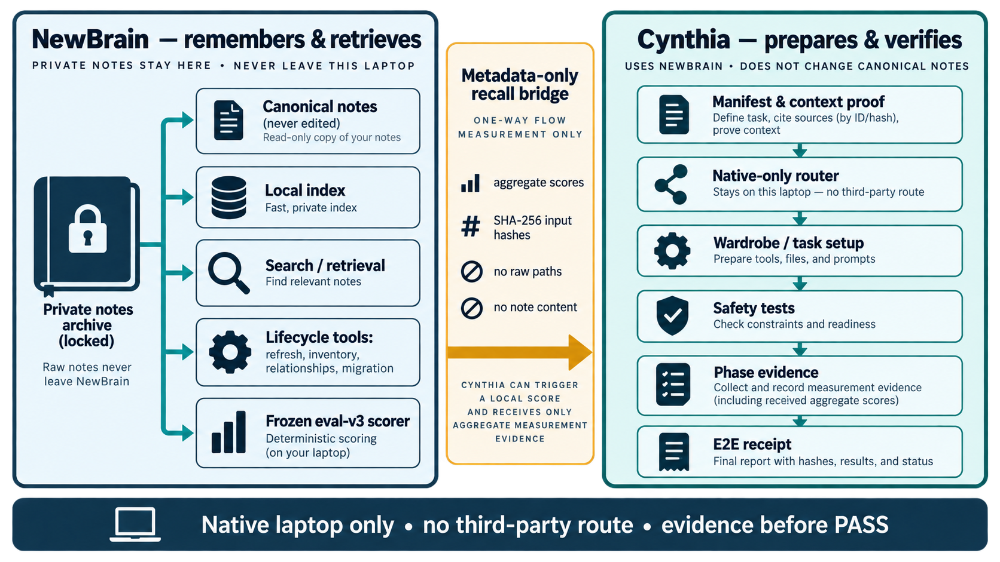
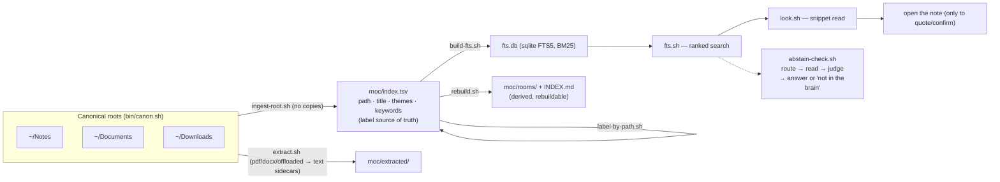

# Data Brain — a no-copy second brain for LLM & AI agents

A personal knowledge index that lets an AI agent
search, read, and honestly abstain over YOUR notes without moving or editing the originals.
It stores derived search data, including extracted text, in its own working folder. The
terminal engine uses bash and sqlite FTS5 without a model call or network connection.

## Download for Claude Desktop (macOS)

**What DataBrain will not read:**

- Folders named `Resources/Sensitive`, `.git`, `node_modules`, `.obsidian`, `.ssh`, `.gnupg` and `.aws`, and any file that is not `.md`, `.txt`, `.pdf`, `.docx`, `.doc`, `.pages` or `.rtf`.
- Names are checked first, then text is checked on your Mac. Nothing is sent.
- Anything that looks private is held back until you say it is fine: taxes, bank, ID, medical, payslips, passwords, keys, contracts, in English and French, and any text with an IBAN, card number, social security number or private key.
- Scanned images such as `IMG_2231.jpg` are not checked.

**Do this:**

1 → Download **[databrain-0.1.6.mcpb](https://github.com/MelchiorLaTour/data-brain/releases/download/v0.1.6/databrain-0.1.6.mcpb)**.  
2 → Open **Claude → Settings… → Extensions**. (**Extensions** is in the left list, under **This computer**.)  
3 → Click **Advanced settings**.  
4 → Click **Install extension**. (Bottom of the page, under **Extension developer**.)  
5 → In the window that opens, click **databrain-0.1.6.mcpb**, then click **Open** at the bottom right. (It is in **Downloads**, in the left list. If your Mac added a number to the name, such as **databrain-0.1.6 (1).mcpb**, click that one.) [CHECK]  
6 → Click **Install**. (The **Configure DataBrain** window opens next.)  
7 → Under **Folders DataBrain may use**, click **Add directory** and pick **Desktop**. Do it again for **Documents**. Nothing gets moved. (Click **Add directory**. An empty row appears. Click the **folder icon** at the right end of that row. In the window that opens, click **Desktop** in the left list, then click **Open** at the bottom right. Click **Add directory** again and do the same with **Documents**. Leave **DataBrain folder location** as it is. To search other folders later, add them here the same way. If you close this window by mistake: **Claude → Settings… → Extensions → DataBrain → Configure**.) [CHECK]  
8 → Click **Save**.  
9 → You can delete the downloaded file now. (It is in your **Downloads** folder.)  
10 → In a new chat, send this message: `Set up my DataBrain` (Claude may list files that look private and ask which are fine to index. If you are not sure, say **none**.)  
11 → When your Mac asks to let Claude access your Desktop or Documents folder, click **OK** (or **Allow**). (It can appear while Claude sets up. Documents, Desktop, Downloads, iCloud Drive, and external drives each ask once.) [CHECK]  
12 → When Claude says DataBrain is set up, send this message: `In DataBrain, what's in my [a file name from your Desktop]?`  

That's all. DataBrain lives in your home folder: **Finder → Go → Home**. Same steps with copy buttons: [app guide](Mac%20download/Claude%20app/databrain-app-guide.html).

Pre-release: tested on one Mac. The terminal route for Claude Code is in [INSTALL.md](INSTALL.md); test status is in the [acceptance ledger](setup/ACCEPTANCE.md).

## Compatibility

The terminal setup targets Claude Code on macOS. A separate Claude Desktop extension is
published as a pre-release; the acceptance ledger above records what has been tested. Its package,
setup flow, tests, and current limits are described in
[setup/README.md](setup/README.md). [docs/COMPATIBILITY.md](docs/COMPATIBILITY.md) describes
the older terminal integration; use the acceptance ledger above for the extension's status.

### OpenAI clients

The intended novice route is to paste [this repository link](https://github.com/MelchiorLaTour/data-brain)
into ChatGPT desktop's Codex view and ask it to download and set up DataBrain. **That route
is not available yet:** the local Codex bundle is not a signed public download and has not
passed physical ChatGPT desktop or CLI acceptance. The local server requires a Codex Local
chat in a local project; ordinary Chat/Quick chat and ChatGPT Work do not provide this local
MCP route. Codex auto-discovers `AGENTS.md` from the primary local-project folder, so a pasted
GitHub URL alone does not attach the repository or load its instructions. The first-turn
clone/read/bootstrap handoff is unverified, and this project-selection step means the strict
"paste one link into any ChatGPT chat" target is not met yet. Review the
[ChatGPT desktop guide](setup/codex/CHATGPT-DESKTOP.md),
[Codex CLI guide](setup/codex/CLI.md), and
[Codex acceptance ledger](setup/CODEX-ACCEPTANCE.md) for current limits.

## Architecture

## Use visualization

```mermaid
flowchart LR
    subgraph roots["Canonical roots (bin/canon.sh)"]
        A["~/Notes"] ; B["~/Documents"] ; C["~/Downloads"]
    end
    roots -->|"ingest-root.sh (no copies)"| I["moc/index.tsv\npath · title · themes · keywords\n(label source of truth)"]
    I -->|label-by-path.sh| I
    I -->|build-fts.sh| F["fts.db (sqlite FTS5, BM25)"]
    roots -->|"extract.sh (pdf/docx/offloaded → text sidecars)"| X["moc/extracted/"]
    I -->|rebuild.sh| M["moc/rooms/ + INDEX.md\n(derived, rebuildable)"]
    F --> S1["fts.sh — ranked search"]
    S1 --> S2["look.sh — snippet read"]
    S2 --> S3["open the note (only to quote/confirm)"]
    S1 -.-> AB["abstain-check.sh\nroute → read → judge\n→ answer or 'not in the brain'"]
```

The search ladder is the point: **read-less-first**. The agent scans ranked hits, reads cheap
snippets from the extract tier, and only opens a full note to quote it. `DOCTRINE.md` is the
behavioral half — when to search, how to decompose a question into tight keywords, and when to
honestly say "not in the brain" instead of guessing.

## Philosophy

- **Original files stay in place.** The brain is an *access layer*: an index of labels and
  derived search text pointing at canonical paths. Delete the generated brain data, and the
  original files remain in their folders.
- **Never move or rename a Finder-visible file.** Labels live in `moc/index.tsv`, not in your
  folder structure. Organizing = editing a TSV row, not dragging files.
- **Agent-OFF engine.** Everything in `bin/` is pure bash + ripgrep + sqlite. It runs cold, in
  any terminal, with no model in the loop. The model supplies judgment (query decomposition,
  abstain decisions, synthesis), never plumbing.
- **Honest abstention over forced matches.** `⚠ WEAK MATCH` output is the mechanical basis for
  answering "that's not in the brain" — the failure mode this system was built to kill is an
  agent confidently answering about your notes without ever looking.

## What's in the box

| Piece | What it does |
|---|---|
| `bin/canon.sh` | **EDIT template** — your canonical roots + prune lists + artifact ignore list |
| `bin/ingest-root.sh`, `build-index.sh` | walk roots, append new files to `index.tsv` (dedup, no copies) |
| `bin/label-by-path.sh` | **EDIT template** — folder → room mapping, fills unlabeled rows only |
| `bin/extract.sh` | plaintext sidecars for PDFs/docx/iCloud-offloaded files (800KB body cap) |
| `bin/build-fts.sh`, `fts.sh` | sqlite FTS5 build + BM25-ranked search |
| `bin/look.sh` | ranked hits + capped snippets — the primary read path |
| `bin/abstain-check.sh` | 2–3 query variants → routing hint (CONVERGENT/MIXED/DIVERGENT/DRY) |
| `bin/search.sh` | exact-phrase regex fallback over live note bodies |
| `bin/refresh.sh` | one-command freshness pass (ingest → label → extract → rebuild → FTS) |
| `bin/rebuild.sh` | redraw derived room MOCs from the index |
| `bin/compile-room.sh`, `stale-wikis.sh`, `room-stamp.sh` | on-demand room wikis + anti-rot stamps |
| `bin/capture.sh`, `file-note.sh`, `index-add.sh`, `synth-save.sh` | capture + write-back paths |
| `bin/lint.sh`, `recent.sh`, `inbox-status.sh`, `reach-map.sh` | health + maintenance |
| `bin/delete-candidates.sh`, `verify-dupes.sh` | LIST-ONLY cleanup reports (never delete anything) |
| `bin/brain-digest.sh`, `register-digest-hook.sh` | SessionStart priming digest (Claude Code hook) |
| `bin/expand.sh`, `backfill-*.sh`, `label-container-types.sh`, `kw-dict.tsv` | optional/experimental — headers state what was measured, incl. negative results |
| `DOCTRINE.md` | the agent-side access doctrine (load into your agent's context) |
| `templates/` | MAP skeleton + discovery-hook trigger rows |
| `install.sh` / `verify-install.sh` | one-command bootstrap + machine-checked acceptance gates |

## Documentation

| Doc | What's in it |
|---|---|
| [docs/HOW-IT-WORKS.md](docs/HOW-IT-WORKS.md) | the deep walkthrough: index anatomy (index.tsv, fts.db, extracts), the read-less-first search ladder with real commands, the labeling misc-trap, why the doctrine exists |
| [docs/COMPATIBILITY.md](docs/COMPATIBILITY.md) | full platform matrix: agent platforms, operating systems, the exhaustive macOS-only list, dependencies |
| [docs/TROUBLESHOOTING.md](docs/TROUBLESHOOTING.md) | sandbox-tested failure modes: installer refusals, verify-install output interpretation, empty search results, labeling and refresh pitfalls |
| [DOCTRINE.md](DOCTRINE.md) | the agent-side access doctrine — the behavioral half, loaded into your agent's context |
| [INSTALL.md](INSTALL.md) | the hybrid bootstrap: install.sh does the deterministic work, one agent step authors your taxonomy |
| [docs/MIGRATION.md](docs/MIGRATION.md) | AI-readable setup, relationship pass, four-stratum recall gate, and safe Obsidian migration |

## Use cases

- You keep notes as plain files (Markdown, PDFs, docx) scattered across real folders and want
  your coding agent to answer "what do I know about X?" from them — without a migration.
- You want **honest** retrieval: "not in the brain" as a first-class answer, not hallucinated
  recall.
- You want capture → label → find with zero vendor lock-in: the whole state is one TSV + one
  rebuildable sqlite file.

## When NOT to use this

- **You want semantic/embedding search.** Deliberately absent. The author evaluated a local
  embedding model against this corpus and **rejected it**: portability cost (Python + model
  weights vs. pure bash) outweighed measured gains, and query decomposition by the agent closed
  most of the gap. If your notes need conceptual similarity search, use a vector tool instead.
- **You have under a few hundred notes.** Just grep. This earns its keep at ~1,000+ files
  spread over messy roots.
- **Your notes live in cloud apps** (Notion, Evernote, Apple Notes without export). The engine
  indexes *files on disk*. Export first or look elsewhere.
- **You require a physically verified Claude Desktop extension.** The available v0.1.0
  prerelease has not been installed in Claude Desktop or checked against a real corpus.

## Security notes

- The terminal engine makes **no network calls**; it reads your files and writes only inside
  its own `moc/` directory (plus capture destinations you configure). The separate Desktop
  extension's optional install audit requests public GitHub release metadata without sending
  document content.
- `canon.sh` prunes a `Resources/Sensitive/` path by default — keep credentials/secrets in one
  hard-blocked folder and the index never sees them. Pair with a PreToolUse hook that refuses
  agent reads of that path (pattern in the companion claude-optimization repo).
- `delete-candidates.sh` and `verify-dupes.sh` are LIST-ONLY by design: nothing in this repo
  deletes, moves, or renames your files. The riskiest write anywhere is appending a TSV row.
- Review any hook before registering it: hooks run arbitrary shell in your session.

## Portability

Claude Code is the supported and tested target today; everything below is the honest
future-portability story (details and per-platform status: [docs/COMPATIBILITY.md](docs/COMPATIBILITY.md)).

- **Engine:** any machine with bash, ripgrep, and sqlite3 (macOS out of the box; note
  `ls -lO`-based iCloud-offload detection is macOS-specific — harmless elsewhere).
- **Agent:** any model that can run shell commands can in principle drive the full ladder —
  Codex-style CLIs, open-weights models in an agent harness (untested). `DOCTRINE.md` is
  plain markdown; paste it into any agent's context.
- **Claude Code-specific:** only the SessionStart digest hook wiring
  (`register-digest-hook.sh`) and the discovery-hook trigger rows in `templates/`. The
  *pattern* (prime each session with a bounded map + access line) ports to any harness with
  session-start hooks.

## Measured results — author-measured, N=1, on his corpus

These numbers come from the author's own ~1,650-note corpus and have not been independently
reproduced; treat them as existence proofs, not benchmarks.

- Room-wiki A/B (compiled wiki vs. raw search, 30 questions): **28 wins / 0 losses / 2 ties**
  for the wiki, with **~43% fewer tool calls**.
- Trap-honesty eval (10 questions whose answers are NOT in the corpus): **10/10 honest
  abstentions** using the route→read→judge ritual, 0 false abstentions on answerable controls.
- Corpus-hygiene pass (labels + keywords + extracts): cold-start hits@3 **55% → 64%**.
- Mechanical query expansion (`expand.sh`) was measured to HURT ranked retrieval and is shipped
  disconnected, as a documented negative result.

## Install

The Claude Desktop extension is available as an unverified
[v0.1.0 prerelease](https://github.com/MelchiorLaTour/data-brain/releases/tag/v0.1.0). Its
intended first-run flow is one `.mcpb` download, installation through Claude Desktop's
Extensions settings, and a new chat with **“Set up my DataBrain.”** Physical installation,
restart, and real-corpus retrieval remain unverified; see [setup/README.md](setup/README.md)
for package and test status.

The established terminal installation is two layers:

1. **`./install.sh`** [no LLM needed] — checks dependencies (ripgrep, sqlite3), walks you
   through picking your note roots, builds the index and the ranked-search database, and
   smoke-tests a query. It deliberately leaves every row **unlabeled**: the labeler only ever
   fills unlabeled rows, so stamping default labels before your real folder→room mapping
   exists would make that mapping permanently ineffective.
2. **Hand `INSTALL.md` to your agent** — the one step that needs judgment: it proposes your
   room taxonomy from your real folders, confirms it with you, writes the mapping, and labels
   the index.

Run `bash verify-install.sh` anytime for a machine-checked PASS/FAIL of the whole install.

## License

MIT — see [LICENSE](LICENSE).
